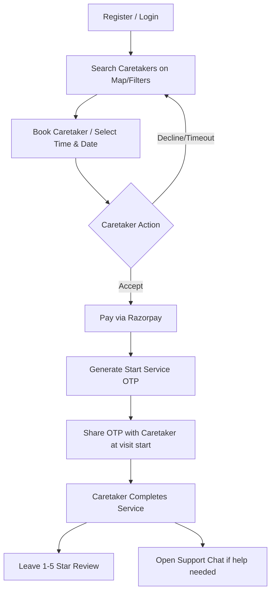
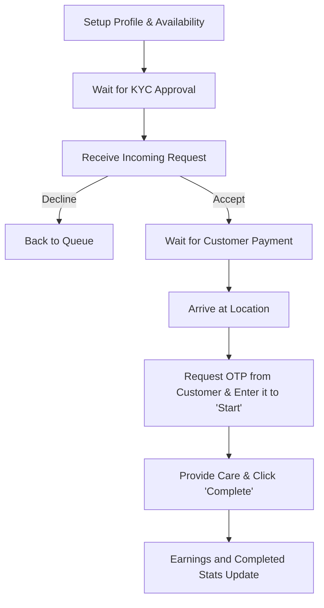

# NestLife — Elder Care Booking Platform

NestLife is a comprehensive MERN stack platform designed to seamlessly connect families (Customers) with qualified, professional Caretakers for elderly care. The application supports detailed role-based access control, real-time location-based searching, integrated messaging, secure payment options, and service verification protocols.

---

## Core Features

1. **Role-Based Authentication**
   - Secure register and login flows (JWT and bcryptjs) for **Customers**, **Caretakers**, and **Admins**.
   - Custom dashboard views tailored to the logged-in role's daily operations.

2. **Caretaker Discovery & Search (Map & Filters)**
   - Find caretakers in real-time using a geographic map view powered by **Leaflet**.
   - Filter caretakers by **City**, **Service Type** (including dynamically loaded custom caretaker services), **Hourly Rate**, and **Ratings**.

3. **Availability & Booking Engine**
   - Caretakers define their weekly schedules (days and hours of availability).
   - Customers choose care slots that are dynamically verified against the caretaker's availability.
   - Core booking lifecycle statuses: `Pending` ➔ `Accepted` ➔ `In Progress` ➔ `Completed` / `Cancelled` / `Declined`.

4. **Service Verification via OTP (Start Service)**
   - A secure OTP handshake mechanism to verify that caretakers are physically present before commencing services.
   - When a caretaker attempts to "Start Service," they must enter a 6-digit OTP that is only visible on the Customer's booking details page.

5. **Integrated Razorpay Payments**
   - Built-in test mode checkout flow using **Razorpay SDK** for processing digital payments.
   - "Pay Now" options rendered on the Customer's dashboard and bookings list for accepted visits.

6. **Real-time Chat with Support Integration**
   - A floating **Socket.io** chat widget allowing real-time communication between customers and caretakers on active bookings.
   - **Dedicated Support Chat**: Customers and caretakers can click "Support" in the navbar to open a chat directly with the platform Admin. The admin's profile avatar is shown in the chat header, disguised under the name **"Support"** for absolute brand consistency.

7. **Reviews & Feedback System**
   - Customers can rate caretakers from 1 to 5 stars and leave written feedback upon successful completion of a service.
   - The caretaker's average rating and total reviews update dynamically.

8. **Admin Operations**
   - Manage all platform users, activate/suspend accounts, and delete records.
   - Review caretaker verification and KYC applications to ensure only qualified caretakers are listed on the platform.
   - Review platform-wide statistics (Bookings by Status and Monthly Revenue) visually mapped out on dashboard charts.

---

## User Workflows & System Lifecycles

### 1. The Customer (Elder's Family) Workflow


- **Discovery:** Browse nearby caretakers on a Leaflet Map or filter by service categories.
- **Booking:** Select an elder, date, start/end time, and add specific care instructions.
- **Payment:** Once accepted, click **"Pay Now"** on the dashboard. Use test credit cards or simulated NetBanking on the Razorpay modal.
- **Handshake:** At the start of the service, retrieve the secure **Start Service OTP** from the "My Bookings" page and tell it to the caretaker.
- **Feedback:** Once complete, review the caretaker.

---

### 2. The Caretaker Workflow

- **Onboarding:** Create a detailed profile including specialized services, biography, hourly rates, and check off weekly availability.
- **Requests:** Accept or decline incoming service requests in real time from the dashboard.
- **Execution:** 
  1. Once accepted and paid, travel to the location on the scheduled date.
  2. Ask the customer for the **Start Service OTP** and input it to change the booking status to `In Progress`.
  3. Perform the care and click **"Complete"** to finish.
- **Analytics:** View total completed visits, average customer ratings, reviews, and a rolling calculation of **Total Earnings** directly on the dashboard.

---

### 3. The Support (Admin) Workflow
- **User Audits:** View and suspend/unsuspend users or delete spam registrations.
- **Verification Desk:** Review caretaker document submissions to approve or reject profiles.
- **Analytics Desk:** Track bookings metrics (Pending, Accepted, In Progress, Completed, Cancelled) and monthly revenue distributions.
- **Support Widget:** Receive incoming customer/caretaker support inquiries directly within the support chat widget and reply in real time.

---

## Tech Stack & Architecture

- **Frontend Framework:** React 19, Vite, React Router DOM (v6), Tailwind CSS
- **Backend Server:** Node.js, Express (v5), Socket.io (v4), Mongoose (v9)
- **Database:** MongoDB
- **Third-Party APIs:** Razorpay Payment Gateway, Leaflet Maps

---

## Local Development & Setup

### 1. Prerequisites
- Node.js v18+
- MongoDB instance running locally (port 27017) or Atlas URI
- Razorpay API Test Keys

### 2. Install Dependencies
Run npm installation in both directories:
```bash
# Install backend dependencies
cd server
npm install

# Install frontend dependencies
cd ../client
npm install
```

### 3. Environment Setup
Configure the environment variables in both directories:

**`server/.env`:**
```env
PORT=8000
MONGODB_URI=mongodb://localhost:27017/nestlife
JWT_SECRET=your_jwt_secret_here
RAZORPAY_KEY_ID=rzp_test_TDW4I7EQYHeDMS
RAZORPAY_KEY_SECRET=your_razorpay_secret_here
CLIENT_URL=http://localhost:5173
```

**`client/.env`:**
```env
VITE_API_URL=http://localhost:8000/api
VITE_SOCKET_URL=http://localhost:8000
VITE_RAZORPAY_KEY_ID=rzp_test_TDW4I7EQYHeDMS
```

### 4. Seed Database (Optional)
Run the seed script to pre-populate users, caretaker profiles, and reviews:
```bash
cd server
npm run seed
```

### 5. Running the Application
Spin up both local development environments:
```bash
# Start Express & Socket.io server (Terminal 1)
cd server
npm run dev

# Start Vite React client dev server (Terminal 2)
cd client
npm run dev
```

Open your browser to `http://localhost:5173` to explore.

---

## License
Distributed under the MIT License. See `LICENSE` for details.
